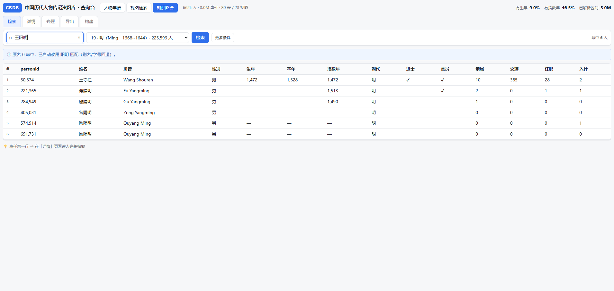
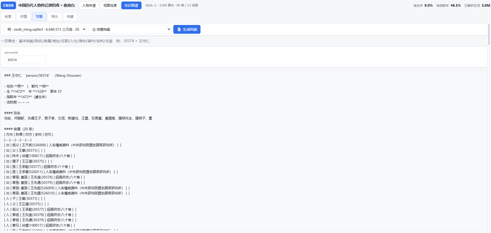
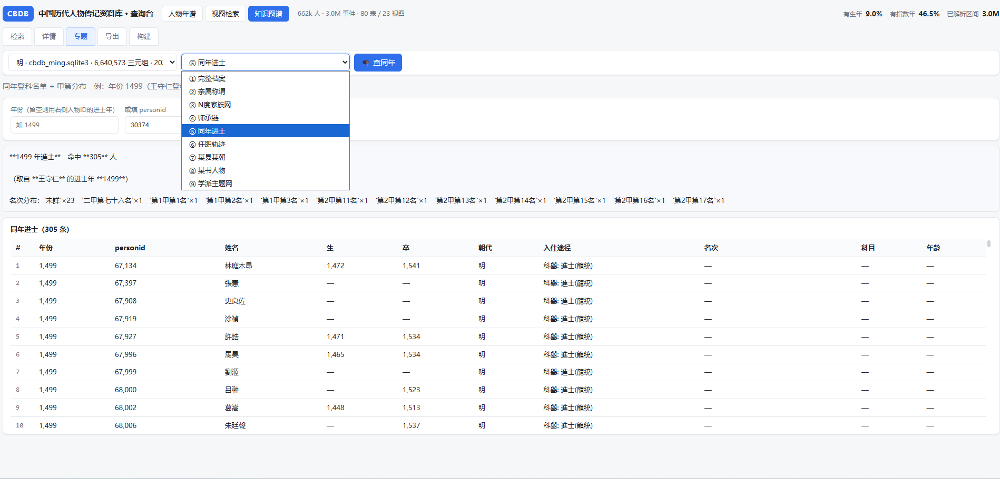
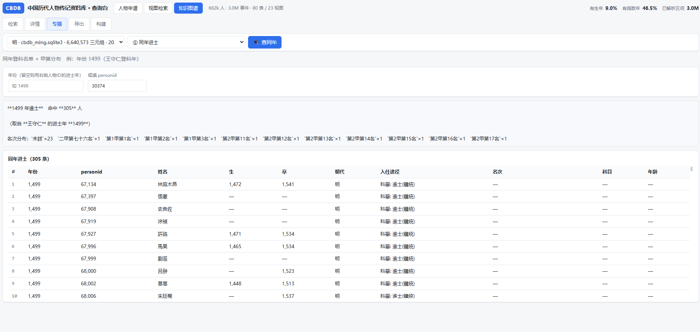

# CBDB 知识图谱（Owlready2 + RDF/OWL + Vue 查询台）

在 CBDB 的 SQLite 关系库之上叠一层**语义层**：把 KIN / ASSOC / POSTING / ENTRY / BIOG_ADDR /
STATUS / BIOG_TEXT 七张表 hub 化成 RDF/OWL 断言，做成 quadstore，再配一台查询台做
亲缘、师承、同年、任官、学派这类**网络型**查询——这些用纯 SQL 写起来动辄十几层自连接。

本体设计见 [`TBOX_v1.0.md`](./TBOX_v1.0.md)（**已冻结**）。

> **界面已迁到 Vue**：原来的 Gradio 界面（`kg/app/` + `app_gradio.py`）已删除，
> 功能全部并入 `web/` 的 Vue 查询台顶栏「知识图谱」模式（`web/frontend/src/components/KgExplorer.vue`）。
> 本目录只保留**逻辑层 + HTTP 接口**：`api_server.py`（端口 8799）把检索/详情/专题/导出/构建
> 以 REST 形式暴露，`web/server.py` 同源反代 `/api/kg/*`。

> 与 `web/` 查询台的分工：`web/` 面向**关系表横向检索**（24 个视图、按列自动生成条件），
> `kg/` 面向**图上的多跳遍历**（A 的师承链、同年进士、学派网络）。两者的数据底座是同一个源库。

---

## 0. 快速开始

```bash
# 依赖（仓库根目录）：owlready2（ETL/本体）+ zhconv（简繁）。Gradio 已移除，不再需要。
pip install -r requirements.txt

# 1) 构建知识图谱（默认明朝 c_dy=19），产物 kg/quadstore/cbdb_dy19.sqlite3 + 同名 .meta.json
python kg/etl_seed_ming.py --db cbdb_20260926.sqlite3 --dy 19

# 2) 启动知识图谱接口服务（端口 8799）
#    ⚠️ 必须用装了 owlready2 / zhconv 的解释器（本机是托管 venv）
<venv>/Scripts/python.exe kg/api_server.py --port 8799        # Windows
<venv>/bin/python         kg/api_server.py --port 8799        # macOS / Linux

# 3) 启动 web 查询台（端口 8787），它会把 /api/kg/* 反代到 8799
python web/server.py --port 8787
# 浏览器打开 http://127.0.0.1:8787 → 顶栏切到「知识图谱」
```

> ⚠️ **`python` 必须和装依赖的是同一个解释器。** 两者不一致时会报
> `ModuleNotFoundError: No module named 'owlready2'`（或 `zhconv`）——包明明装了，
> 只是没装在这个解释器里。用虚拟环境时改成显式指定：
> ```bash
> <venv>/Scripts/python.exe kg/api_server.py --port 8799    # Windows
> <venv>/bin/python         kg/api_server.py --port 8799    # macOS / Linux
> ```
> 查当前解释器：`python -c "import sys; print(sys.executable)"`。
> 两个服务都要常驻（用后台方式启动，别用会被回收的子壳）。

> **也可以不启接口服务**：Web 查询台的「构建」页能直接在界面上跑 ETL（SSE 流式日志）；
> 但检索/详情/专题/导出必须走 8799 接口服务。

源库（`cbdb_20260926.sqlite3`）需先按仓库根 [`README.md`](../README.md) §5.2 准备好。
**`kg/quadstore/` 与 `kg/exports/` 都被 `.gitignore` 排除**——图谱是本地构建产物，不入仓。

---

## 1. 三层数据

| 层 | 位置 | 用途 | 为什么 |
|---|---|---|---|
| ① 源库 SQLite | `cbdb_20260926.sqlite3` | 朝代清单、人物检索 | 这些字段有现成索引，`idx_kin_data_person` 等查询 1.7 秒内出结果，没必要走图 |
| ② quadstore | `kg/quadstore/cbdb_dy<N>.sqlite3` | 人物详情、Q1–Q9 专题 | 语义层，多跳关系靠它 |
| ③ 导出目录 | `kg/exports/<条件>_<日期>/` | 查询结果落盘（CSV/JSON + 条件留痕） | 让"这次结论是怎么跑出来的"可复现 |

**关键设计：检索走 SQL，详情走图。** 两条链路分离，是因为图检索（打开 owlready2 World）慢，
而 SQL 检索快；反过来单人全量详情（<0.1 秒）走图比拼十几条 SQL 干净得多。

---

## 2. 本体：TBox v1.0（已冻结）

实现见 [`tbox_cbdb.py`](./tbox_cbdb.py)，**冻结文档是 [`TBOX_v1.0.md`](./TBOX_v1.0.md)**——
任何修改必须先改冻结文档并升版本号，不允许直接改代码。

几处关键决策：

- **码表统一走 SKOS 风格**：`概念个体 + broader 自关联`，不建 OWL 类层级。
  CBDB 的码表本质是叙词表（如「進士」有多种细分），硬套类继承会失真。
- **断言 hub 化**：七张关系表各自变成一个「断言类」hub 节点，三要素 exactly 1：
  `KinshipAssertion` / `AssociationEvent` / `OfficeTenure` / `EntryRecord` /
  `AddressClaim` / `StatusPeriod` / `TextRoleLink`。
  这样「一次任官」能挂年份、地点、任命类型，而不会把属性硬塞到人身上。
- **推理等价类在 TBox 里定义**（无需 Java 推理机即可用 SPARQL/字典推导）：

  | 类 | 定义 |
  |---|---|
  | `Official` | `Person ⊓ Inverse(tenureHolder) some OfficeTenure` |
  | `JinshiHolder` | `Person ⊓ Inverse(entryPerson) some (EntryRecord ⊓ entryMode some JinshiModes)` |
  | `Female` / `Male` | `Person ⊓ isFemale value true / false` |
  | `MingPerson` | `Person ⊓ dynastyOf value dynasty/19` |

- **单值属性一律 `FunctionalProperty`**：源表每行即单值，省掉推理负担。

> ⚠️ 无 Java 环境时 HermiT / Pellet 跑不了，等价类归类只能改用 SPARQL / SQL 手工对账。
> 这也是「等价类写进 TBox 定义」而非依赖推理机的原因。

---

## 3. ETL：种子集构建

```bash
python kg/etl_seed_ming.py [--db PATH] [--out PATH] [--dy N] [--limit-persons N]
```

| 参数 | 说明 |
|---|---|
| `--db` | 源库路径，默认相对仓库根（`os.path.join(HERE, "..", "cbdb_20260926.sqlite3")`） |
| `--dy` | 朝代 `DYNASTIES.c_dy`：**19=明（默认）**、15=宋、6=唐、20=清、77=周、53=三國蜀 |
| `--out` | 默认 `quadstore/cbdb_dy{N}.sqlite3` |
| `--limit-persons` | 调试用，只加载前 N 个核心人物 |

**种子集 = `BIOG_MAIN.c_dy={--dy}` 的全部人物 + 1 度邻域**（亲属 / 交遊对端）。
以明朝为例：核心集 225,593 人，加邻域后图内 `Person` 共 229,567。

### ETL 铁律（R1–R8，改动前必读）

| 编号 | 规则 | 为什么 |
|---|---|---|
| R1 | 零值（`0` / `NULL`）不落图 | RDF 里空值是开销而非信息，写进去只会让图膨胀、查询变慢 |
| R2 | `MERGED_PERSON_DATA` 的 ID 归一（链式解析到根） | 否则同一个人会有两个节点，图直接裂开 |
| R3 | 断言 hub 化 + 直边派生 | 既保留"这次任官"的完整上下文，也能 `tenureHolder` 直接连人，兼顾两种查询 |
| R4 | 邻域人物用轻量节点 | 只带姓名等最少属性，否则图会因邻域爆炸 |
| R5 | 地址层级用 `ADDRESSES` 物化，不现场递归 | 现场解析行政隶属会反复扫表 |
| R6 | 码表全量加载 | 概念个体要能覆盖历史行政区划，不能只加载用到的 |
| R8 | 年份一律 `int` | 避免字符串比较把 `"1000"` 排在 `"999"` 前 |

### 产物与 `.meta.json` 侧车

ETL 结束后在同目录写一份同名 `.meta.json`，查询台靠它列出「已构建的图谱」：

```json
{
  "dy": 19, "dynasty": "明", "built_at": "2026-09-30 10:09:47",
  "seconds": 122.0, "size_mb": 587.5, "triples": 6640573,
  "counts": { "Person": 229567, "KinshipAssertion": 283144, "OfficeTenure": 117332, ... }
}
```

实测规模：

| 朝代 | `--dy` | 三元组 | 体积 | 耗时 |
|---|---:|---:|---:|---:|
| 明 | 19 | 6,640,573 | 587.5 MB | 122.0 s |
| 宋 | 15 | 3,336,558 | 294.8 MB | 54.9 s |
| 周 | 77 | 67,410 | 6.8 MB | 2.6 s |
| 三國蜀 | 53 | 26,191 | 3.4 MB | 2.1 s |

> 缺 `.meta.json` 的 quadstore 在应用里会显示为「未知朝代」。
> 明朝那份 meta 是**事后手工补写**的，所以没有「核心 / 邻域」拆分；
> 后来构建的（宋等）会由脚本自动写入 `Person(核心)` / `Person(邻域)` 两项。

---

## 4. 查询底座：GraphIndex（内存谓词子图）

[`kg_graph.py`](./kg_graph.py) 只做一件事：把 quadstore 里用到的谓词子图**一次性抽进内存**
（约 3.4 秒 / 292 万边），之后所有查询都是纯字典查找（毫秒级）。

**为什么不直接用 owlready2 的 SPARQL？** 它自带的解析器**不支持尖括号 IRI**（`<http://…>` 直接
ParsingError），不支持属性路径，且大数据量下很慢。与其绕，不如一次性建索引。

```python
from kg_graph import get_index
g = get_index("kg/quadstore/cbdb_dy19.sqlite3")   # 按路径缓存
g.E["hasKin"][storid]        # 对象属性：prop → 主语 → [宾语]
g.D["birthYear"][storid]     # 数据属性：prop → 主语 → 值
```

⚠️ **quadstore 里有两张表，别混**：`objs(c,s,p,o)` 存对象属性（`o` 是 storid）；
`datas(c,s,p,o,d)` 存数据属性——**字面量值在 `o` 列，`d` 列是数据类型 / 语言标签**
（中文标签的 `d = '@zh'`）。直接连库写 SQL 时最容易在这里搞错。

⚠️ **`rev(prop)` 是懒构建的反向索引**，返回 `o → [s]`：**key 是宾语侧的 storid**，
value 才是主语列表。例如 `belongsTo` 的 key 是父级 `Place`（不是断言 hub 节点），
所以 `rev("belongsTo")` 能拿来求行政区的**后代闭包**（见 `place_closure`），
但**不能**把 key 当成某条断言的 id 去查它的其它属性。

### 与 owlready2 的写锁共存

owlready2 的 `World` 会**长期持有 quadstore 的写事务**，导致 `kg_graph` 的只读连接报
`database is locked`。典型症状：先点「详情」再点专题页会失败。
`get_index()` 检测到 locked 时会先释放本进程的 World 缓存再重读。

---

## 5. 专题查询 Q1–Q9

实现全在 [`kg_query.py`](./kg_query.py)，**不依赖任何界面框架，可单独自检**：

```bash
python -c "import kg_query"          # 只验证能否导入
```

统一调用契约：`qN_xxx(g: GraphIndex, ...) -> (headers, rows, md)`，
双表（图）返回 `(headers_nodes, nodes, headers_edges, edges, md)`，Q1 返回 `(md, flat_rows)`。

| 编号 | 函数 | 专题 | 备注 |
|---|---|---|---|
| Q1 | `q1_dossier` | 人物履历完整档案 | 基本信息 + 别名 + 亲属/地理/任职/著作/身份六段 |
| Q2 | `q2_kin` | 亲属关系（双向） | |
| Q3 | `q3_kinnet` | 亲属 / 关系网络（k 度） | 可选含交遊，**超 3000 节点截断** |
| Q4 | `q4_teacher` | 师承链 | 向上求师 / 向下授徒，可设深度 |
| Q5 | `q5_jinshi` | 同年进士 | 按年份查，或给某人反查 |
| Q6 | `q6_tenure` | 任职网络（官职链） | |
| Q7 | `q7_county` | 同里 / 籍贯 | 关键词 + 朝代，**简繁归一** |
| Q8 | `q8_book` | 著作来源 | 一本书记了哪些人 |
| Q9 | `q9_topic` | 学派 / 主题网络 | 概念节点 + 关联人物 |

> 加第 10 个查询：在 `kg_query.py` 加函数 → 在 `topic_dispatcher.py` 的 `TOPIC_SCHEMA`
> 加一条声明（key / tab / hint / btn / fields）并在 `run_topic()` 里接上，
> 前端表单由该 schema 自动渲染（无需改 Vue 代码）。

**⚠️ 稀疏字段实测（明）**：`assocTopic` 25 条 / `assocGenre` 0 条 / `assocOccasion` 12 条。
所以 Q9 主题类查询必须走 `assocType` 的名称，别指望 topic/genre 字段有数据。

---

## 6. Vue 查询台（顶栏「知识图谱」）

Gradio 界面已删除。现在 GraphIndex 之上只暴露 HTTP 接口，界面完全在 `web/`：

| 位置 | 文件 |
|---|---|
| 接口服务 | `kg/api_server.py`（端口 8799） |
| 同源反代 | `web/server.py` 的 `_proxy_kg()`（`/api/kg/*`） |
| 前端 | `web/frontend/src/components/KgExplorer.vue`（检索 / 详情 / 专题 / 导出 / 构建） |
| 力导向图 | `web/frontend/src/components/KgGraph.vue`（vis-network） |

**五个内部 Tab**

| Tab | 内容 |
|---|---|
| 检索 | 按姓名（简繁自动扩展 + 别名/字号回退链）/ 朝代 / 生卒区间 / 进士 / 官员检索；点行跳详情 |
| 详情 | 人物档案 8 个分区表（亲属/交遊/任职/入仕/地址/身份/著作/史料）；无图谱时回退源库基本信息 |
| 专题 | Q1–Q9，表单由 `topic_dispatcher.TOPIC_SCHEMA` 自动渲染；**Q3/Q9 额外出力导向图** |
| 导出 | 把当前检索条件命中的人物导出 CSV（utf-8-sig，ASCII 文件名） |
| 构建 | 界面上跑 ETL 构建新朝代图谱，**SSE 流式显示日志**，完成后自动刷新图谱清单 |



输入「王阳明」原名 0 命中 → 自动改用别名「陽明」命中 **王守仁（person/30374）**，
结果表 14 列 = `RESULT_HEADERS`，并给出回退说明。



详情页（`生成档案`）一键拉出 10 个分区：基本档案 / 别名 / 亲属 / 地址 / 任职 / 入仕 / 身份 / 著作 / 史料 / 交遊。
全程只读 GraphIndex，不开 owlready2 World。





九个专题共用一份声明式 schema；上面第二张示例：给年份 1499 查**同年进士**（命中 305 人），
也给某人反查其同年名次分布。

接口一览（前端走同源相对路径，由 `web/server.py` 反代到 8799）：

| 方法 | 路径 | 说明 |
|---|---|---|
| GET | `/api/kg/health` · `/dynasties` · `/quads` · `/topics` | 元信息与下拉选项 |
| GET | `/api/kg/person/<id>` | 人物详情（自动选含该人的图谱；找不到则回退源库） |
| POST | `/api/kg/search` | 检索（含简繁 + 别名/字号回退链） |
| POST | `/api/kg/topic` | Q1–Q9 专题查询 |
| POST | `/api/kg/export` | 导出 CSV |
| POST | `/api/kg/build` | ETL 构建（**SSE 流式**，结束后关闭连接以终止流） |

> ⚠️ **SSE 必须显式 `close_connection = True`**：请求是 HTTP/1.1，默认 keep-alive，
> 不关的话上游永远不发 EOF，代理的分块转发循环读不到结束 → 前端流一直挂起。

**CBDB 是繁体库**：搜「王阳明」原名 0 命中，靠 `search_persons_fallback` 的自动回退链
（原名 → 别名 → 去姓氏 + 字号）命中「王守仁」。新接口必须走这套，别只调 `search_persons`。

---

## 7. 验证

```bash
# 图谱验收：OWL 侧实例/三元组计数 vs 源库对账（必须在 ETL 结束后跑，否则 quadstore 被写锁占用）
python kg/kg_stats.py --quad kg/quadstore/cbdb_dy19.sqlite3
python kg/kg_stats.py --sample 王守仁           # 额外跑抽检查询

# 接口自检（需先启动 8799 接口服务；本机 localhost 有代理，curl 要加 --noproxy '*'）
curl --noproxy '*' http://127.0.0.1:8799/api/kg/health
curl --noproxy '*' http://127.0.0.1:8799/api/kg/quads
curl --noproxy '*' -X POST http://127.0.0.1:8799/api/kg/search \
     -H 'Content-Type: application/json' -d '{"dy":19,"name":"王阳明","limit":5}'
curl --noproxy '*' http://127.0.0.1:8799/api/kg/person/30374

# 专题 / 导出 / 构建（走前端真实路径：8787 反代）
MING="$(pwd)/kg/quadstore/cbdb_dy19.sqlite3"
curl --noproxy '*' -X POST http://127.0.0.1:8787/api/kg/topic \
     -H 'Content-Type: application/json' -d "{\"key\":\"Q6\",\"quad\":\"$MING\",\"vals\":[30374]}"
curl --noproxy '*' -D - -o /tmp/kg.csv -X POST http://127.0.0.1:8787/api/kg/export \
     -H 'Content-Type: application/json' -d '{"dy":19,"name":"王阳明","limit":6}'   # 看 Content-Disposition
curl --noproxy '*' --no-buffer -X POST http://127.0.0.1:8787/api/kg/build \
     -H 'Content-Type: application/json' -d '{"dy":55,"limit":0}'                    # 末尾应有 {"done":true}
```

**验证一律走 HTTP，不要手动点界面**——手动测不出「浏览器实际提交值」（如空数字输入会变成 `0`），
也测不出反代与流式转发这类只在链路上才暴露的问题。建议用**未构建过的小朝代**（如 `dy=55`）
试 `build`，避免覆盖已有 quadstore；测完记得删掉 `quadstore/cbdb_dy55.sqlite3*` 产物。

---

## 8. 导出

界面上「导出」Tab 走 `POST /api/kg/export`：按「检索」页当前条件重跑一遍检索，
把**命中全集**（与屏幕分页、列勾选无关）写成 CSV 直接下载，文件名形如 `cbdb_kg_dy19_6.csv`。

- 编码 **utf-8-sig**（Excel 直接打开不乱码）；
- 文件名刻意只用 ASCII——HTTP 头按 latin-1 编码，中文文件名会抛 `UnicodeEncodeError`；
- `Content-Disposition` 由 `web/server.py` 的反代**透传**，否则前端拿不到文件名（下载后是随机 blob 名）。

### 目录式导出（`export_results` / `export_page`，暂未接进界面）

`kg_backend.py` 里还留着一套「导出成目录、带条件留痕」的实现（原来由 Gradio 导出页调用）：

```
kg/exports/①_完整档案_person30374_20260930/
  ├── 档案明细.csv        结果数据（utf-8-sig）
  ├── 档案明细.json
  ├── conditions.json     复现所需的全部条件 + 导出时间 + 各表行数
  └── README.md           人类可读的条件摘要（结果为空时只有这一个文件）
```

`conditions.json` 会记下当时的 quadstore 与源库路径便于回溯；`with_detail=True` 还会附带
`details/` 子目录（每人一份详情，默认上限 50 人）。目前**只有 `kg/.bak/app_gradio.py`（已删除界面的备份）
在调它**，界面侧未接线——需要「可复现的导出留痕」时可直接 import 调用。

> ⚠️ 导出目录**含本机绝对路径**，因此已被 `.gitignore` 排除，不会进仓。

---

## 9. 文件

```
kg/
  README.md              本文件（总览：本体 / ETL / 查询 / 界面 / 验证 / 导出）
  tbox_cbdb.py           TBox v1.0 的 Owlready2 实现（本体定义，冻结）
  TBOX_v1.0.md           本体设计冻结文档 ★改本体先改这里
  etl_seed_ming.py       种子集 ETL（默认明朝，--dy 可换朝代）
  kg_graph.py            quadstore → 内存谓词子图索引（GraphIndex）
  kg_query.py            Q1–Q9 专题查询实现（纯函数，不依赖界面，可单独自检）
  kg_backend.py          三层数据后端：检索 / 详情 / 导出 / 跑 ETL
  topic_dispatcher.py    Q1–Q9 的调度层：TOPIC_SCHEMA（JSON 字段规格）+ run_topic()
  api_server.py          HTTP 接口服务（端口 8799），把上面这些暴露成 /api/kg/*
  kg_stats.py            图谱验收：计数对账 + 抽检
  etl_run.log            ETL 日志（gitignore 内可选保留）
  quadstore/             图谱产物 ★gitignore
  exports/               目录式导出产物 ★gitignore（含本机绝对路径，见 §8）
  .bak/                  已删除的 Gradio 界面备份（不进仓）
```

## 10. 常见问题

| 现象 | 原因 / 处理 |
|---|---|
| `ModuleNotFoundError: No module named 'owlready2'`（或 `zhconv`） | **运行用的 python ≠ 装依赖的 python**。依赖装在 venv 里、`python` 却指向系统/基础解释器时必然如此。用 `<venv>/Scripts/python.exe` 显式运行，见 §0 |
| `/api/kg/*` 返回 502「知识图谱服务不可达」 | 8799 的 `api_server.py` 没起（或被回收）。用常驻后台方式启动，别用会被回收的 `&` 子壳 |
| 专题查询很慢（首次十几秒） | GraphIndex 首次构建要把谓词子图抽进内存（明 587MB 约几秒）。已用双检锁避免并发重复构建，之后都是字典查找 |
| 点详情/专题报 `database is locked` | 详情页已改走 GraphIndex 只读连接，**不再开 owlready2 World**（World 会长期占写锁）。若 ETL 正在跑，等它结束 |
| 下拉里默认图谱不是明朝 | `quad_choices()` 按**三元组数降序**排（规模优先）。曾按构建时间倒序，导致刚建的「周」小图谱成默认值，查王守仁报「图谱中未找到」 |
| 各朝代图谱都没有这个人 | 详情页会依次去别的图谱探测（`quad_has_person`，毫秒级轻量探测，不开 World），找不到则回退源库基本信息 |
| 搜简体字 0 命中 | CBDB 全库繁体。已做简繁扩展，但姓名还需走别名/字号回退链（`search_persons_fallback`） |
| 校验报 `database is locked` | `kg_stats.py` 要在 ETL 完全结束后跑，两者不能同时占用 quadstore |
| 详情页性别显示为「女」/「未詳」 | quadstore 把 `isFemale` 存成**文本** `"true"`/`"false"`，`bool("false")` 是 `True`。已用 `_parse_bool()` 显式解析，改这类字段时别直接用 `bool()` |
| 构建页日志一直转圈不结束 | SSE 上游必须 `close_connection = True`（HTTP/1.1 默认 keep-alive 不发 EOF），否则代理的分块流读不到结束，见 §6 |
