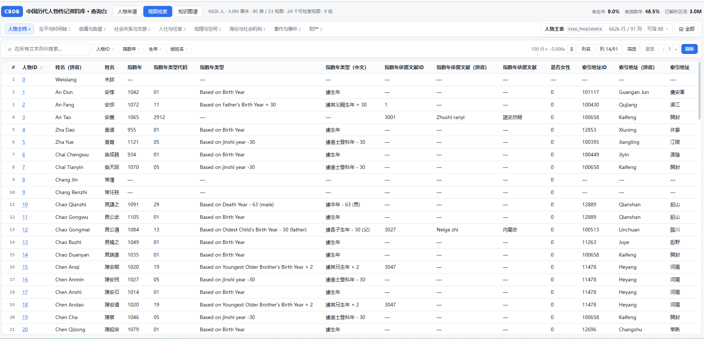
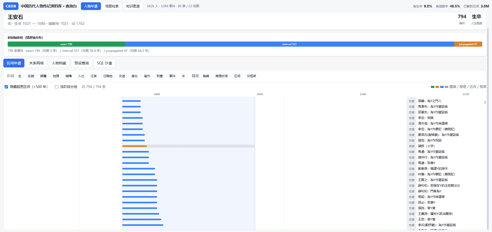

# CBDB 查询台（Vue 3 前端 + 零依赖后端）

基于《CBDB_SQLite_使用报告.md》做的查询页面，共 **三个模式**：
**人物年谱**（单人纵向）· **视图检索**（24 个视图横向检索）· **知识图谱**（图上的多跳遍历）。

其中两处的底座值得单独说明：

- **人物年谱**：核心不是"按年份排序"，而是展示报告 §6.8 的
  **区间轴 + 序轴 + 精度轴**——每条生平事件是一个区间 `[lo, hi]`，而不是一个假年份。
- **知识图谱**：走 `kg/` 的 HTTP 接口（8799），由 `server.py` 同源反代 `/api/kg/*`。
  本目录只负责界面，图谱侧的本体 / ETL / 查询逻辑见 [`../kg/README.md`](../kg/README.md)。

## 启动（两步 + 可选第三步）

```bash
# 1) 后端：只读 API + 静态托管，默认 8787
python web/server.py --db cbdb_20260926.sqlite3 --port 8787

# 2) 打开浏览器
#    http://127.0.0.1:8787/

# 3)（可选）仅「知识图谱」模式需要：知识图谱接口服务 8799
#    必须用装了 owlready2 / zhconv 的解释器
<venv>/Scripts/python.exe kg/api_server.py --port 8799     # Windows
<venv>/bin/python         kg/api_server.py --port 8799     # macOS / Linux
```

后端会直接托管已构建好的 `web/frontend/dist`，**不需要另开 Vite**。
「视图检索」与「人物年谱」只用 8787；没起 8799 时「知识图谱」模式的接口会返回 502 提示，
页面本身仍能打开。

### 开发模式（改前端时）

```bash
cd web/frontend
npm install
npm run dev          # http://localhost:5173 ，/api 已代理到 8787，/api/kg 已代理到 8799
npm run build        # 产出 dist/，交给 server.py 托管
```

> Windows 上 npm 有时会漏装平台原生二进制。若构建报
> `Cannot find module '@rollup/rollup-win32-x64-msvc'` 或 `The package "@esbuild/win32-x64" could not be found`，
> 手动补：`npm install @rollup/rollup-win32-x64-msvc @esbuild/win32-x64`。

## 页面结构

顶部三个主模式（同一顶栏切换，共用同一份只读 API 与静态托管）：

| 模式 | 用途 | 依赖 |
|---|---|---|
| **人物年谱** | 单人纵向视图：搜一个人，看他的区间年谱 / 关系网络 / 档案 / 预设查询 / SQL 沙盒 | 仅 8787 |
| **视图检索** | 横向视图：24 个数据集分成 9 组，**每个视图都有按自身列自动生成的查询条件** | 仅 8787 |
| **知识图谱** | 图上的多跳遍历：检索 / 详情 / 专题 Q1–Q9（Q3·Q9 带力导向图）/ 导出 CSV / 构建 ETL | 另需 8799 |

### 视图检索模式：导航与下钻



24 个视图（23 个 `View_*` + 物化结果表 `LIFE_EVENT_RESOLVED`）按「能否用同一个键互相下钻」分成 9 组：

| 组 | 视图 |
|---|---|
| 人物主档 | PeopleData / PeopleAddrData / BiogSourceData / AltnameData |
| 生平与时间轴 | PersonLifeTimeline / **LIFE_EVENT_RESOLVED** / RelationEdges |
| 亲属与族谱 | KinshipGenealogyData / KinAddrData |
| 社会关系与交游 | AssociationData / TextAssociationData |
| 入仕与任官 | EntryData / PostingOfficeData / PostingAddrData |
| 地理与空间 | BiogAddrData / CountyPeopleData / EventAddrData |
| 身份与社会机构 | StatusData / BiogInstData / BiogInstAddrData |
| 著作与事件 | BiogTextData / EventData |
| 财产 | PossessionsData / PossessionsAddrData |

**导航压成一行**（原来是一条 260px 宽的左侧分组树，横向吃掉大量本该给结果表的空间）：

```
[人物主档4][生平与时间轴3][亲属与族谱2][社会关系与交游2]…（横向滚动） │ 人物主表 View_PeopleData 66.2M 行/91 列 ▾ │ ⊞ 全部
```

- 左边 9 个**分组 tab**：点一下换组，组内保留当前视图
- 右边**当前视图下拉**：列出本组视图，每行显示中文名 + 英文名 + 行数
- 最右 **⊞ 全部**：24 个视图的全量浮层，可按**中文名 / 英文名 / 组名 / 任一列的中文名**搜索

结果表里带 🔗 的列是**关联键**（`c_personid` / `c_addr_id` / `c_office_id` / `c_textid` / `c_source` …）。
点它 → 弹窗按分组列出「还有哪些视图也含这个键」→ 点一个就带着 `该列 = 该值` 跳过去。
若点的是 `c_personid`，弹窗里还能直接切到「人物年谱」看这个人的区间轴。

### 查询条件怎么来的

由 `web/build_view_meta.py` 剖析每个视图的每一列，按列的**实际取值**决定给什么控件：

| 列的类型 | 判定 | 控件 |
|---|---|---|
| `pid` | 列名 `c_personid` | 精确匹配 + 「按姓名搜索」选择器 |
| `year` | 数值且落在 −900…2200 且列名含 year/yr | 起止年区间 |
| `num` | 其它数值 | 最小~最大 |
| `cat` | 取值 ≤ 60 种 | 多选 chips，**每个取值带样本条数** |
| `text` | 取值很多 | 包含 / 等于 / 开头是 |
| 全部 | — | 另可勾「仅非空」「仅为空」 |

### 列名中文化（中文名 ↔ `c_xxx`）

CBDB 的列名是 `c_office_chn` 这种，对新人完全不友好；但同时显示「官职名 c_office_chn」
又会让表头和条件区立刻变乱。这里按「**主显中文、原始名按需露出**」分三档：

| 位置 | 显示 |
|---|---|
| 结果表表头 | **只显示中文名**；hover 出 `中文名（c_xxx）`；点表头排序 |
| 工具栏「列名」开关 | 打开后表头在中文名下方追加小号灰底 `c_office_chn`（偏好存 localStorage） |
| 筛选控件（右侧抽屉） | 中文名 + 小号等宽 `c_office_chn` 跟随 —— 抽屉是"精确配置"的地方，双名不挤 |
| 快捷条件浮层 | 只留中文名，原始名进 tooltip |
| 列选择器 / 抽屉搜索框 | 中文名与原始列名**都能搜** |
| 视图导航 | 视图也给了中文名（如 `View_PostingOfficeData` → 「历任官职」） |

标签表在 [`columns_zh.py`](./columns_zh.py)，两层：`COLUMN_LABELS` 放同义列，
`VIEW_OVERRIDES` 按视图覆盖有歧义的列（同一个 `c_title_chn` 在别处是「出处文献名」，
在 `View_BiogTextData` 里是「著作名」）。当前覆盖 **396 个不同列名 / 713 个「视图.列」，无遗漏**。

```bash
# 只改标签时（不连库、不重新采样，1 秒）
python web/build_view_meta.py --labels-only
```

### 条件区布局：单行工具栏 + 抽屉

一个视图动辄几十个可筛列，把条件卡片全铺在页面上会把结果表挤出屏幕。所以：

```
顶栏（一行）    CBDB 查询台 · 模式切换 · 库概况 · KPI
导航条（一行）  分组 tab ×9 ｜ 当前视图 ▾ ｜ ⊞ 全部
工具栏（一行）  [⌕ 在所有文本列中搜索] [快捷条件▾]… [已选 chips ×]  行数·耗时 ≣ 列名 列 筛选(3) 重置 ‹1› 刷新
结果区（flex 1）吃满剩余高度：表头 sticky（点击排序）、内部滚动、行密度可切
                        ↑ 点「筛选」→ 右侧抽屉，含全部条件、可搜中文名或 c_xx 列名
```

- 视图名 / 行数 / 列数已经并进**导航条**，原独立「视图头」整行取消；
- **排序改成点表头**（升 → 降 → 取消），原「排序下拉」整行取消；
- 工具栏 `flex-wrap: nowrap`：chips 区横向滚动，右侧统计与翻页永远可见；
- 已选条件以 chip 平铺、单个可删，另有「重置」清空全部；
- 抽屉与快捷浮层用的是同一个控件组件 `FilterControl.vue`，不存在两套实现；
- 条件状态会写进 URL hash（可分享 / 刷新 / 后退），也可把常用组合存成本地预设。
- 设计依据与备选方案对比见 [`FILTER_UX.md`](./FILTER_UX.md)。

「在所有文本列中搜索」由后端的 `any` 条件实现（组内多列 OR、与其它 AND 条件并列），
而不是给每个视图写专门的全文查询。

> 剖析时**不能**直接 `LIMIT 30000`：像 `View_PersonLifeTimeline` 这种 14 路 `UNION ALL` 视图，
> 前 3 万行全是「生」这一个分支，`stage` 会被误判成常量。脚本改为先按 `c_personid % K` 物化一张
> 无偏抽样临时表 `_sample`，再逐列剖析。

### 人物年谱模式

| 区域 | 内容 |
|---|---|
| 顶栏 | 数据库概况：人数 / 事件数 / 表与视图数 / 有生年比例 / 有 index_year 比例 |
| 左侧 | 人名搜索（支持中英文、按事件数排序）+ 结果列表 |
| 人物头 | 朝代、生卒、指数年、**人生框架来源**（生卒 / 指数年 / 兜底） |
| 时间轴体检 | 精度轴分布条：精确 / 推理收窄 / 区间 / 仅框架 各占多少 |
| **区间年谱** | 甘特图。灰条 = 传播**前**的先验区间，彩条 = 传播**后**的区间；蓝色底带 = 生卒范围；可勾选阶段与精度筛选 |
| 关系网络 | 一跳关系环形图（蓝=亲属、橙=交游）+ 亲属/交游/任官清单 |
| 人物档案 | 别名字号、地理行迹、各阶段事件数与平均区间宽 |
| 预设查询 | 报告里的 15 条 Cookbook 查询，一键执行 |
| SQL 沙盒 | 只读 SELECT / WITH，20 秒超时，最多 2000 行 |



### 知识图谱模式

界面是 `KgExplorer.vue`，数据来自 `kg/api_server.py`（8799，由本目录的 `server.py` 同源反代）。
内部五个 Tab：

| Tab | 内容 |
|---|---|
| 检索 | 按姓名（简繁自动扩展 + 别名/字号回退链）/ 朝代 / 生卒区间 / 进士 / 官员检索；点行跳详情 |
| 详情 | 人物档案 8 个分区表（亲属/交遊/任职/入仕/地址/身份/著作/史料）；所选朝代图谱里没有此人时回退源库基本信息 |
| 专题 | Q1–Q9（完整档案 / 亲属关系 / 亲属关系网 / 师承链 / 同年进士 / 任职网络 / 同里籍贯 / 著作来源 / 学派主题网）。**表单由后端 `topic_dispatcher.TOPIC_SCHEMA` 自动渲染**，加查询不用改 Vue；Q3/Q9 **额外出力导向图**（`KgGraph.vue` + vis-network，点节点跳详情） |
| 导出 | 把「检索」页当前条件命中的**全部**人物导出 CSV（utf-8-sig，ASCII 文件名；与屏幕分页无关） |
| 构建 | 在界面上跑 ETL 构建新朝代图谱，**SSE 流式显示日志**，结束后自动刷新图谱清单 |


- **检索走 SQL、详情走图**：检索用源库现成索引（1.7 秒内），详情用 quadstore 的内存谓词子图索引
  `GraphIndex`（单人全量 <0.1 秒）。两条链路分开是因为开图慢、写十几条 SQL 又太脏。
- 首次点开某朝代图谱时，后端要把该 quadstore 的谓词子图抽进内存（明 587MB 约十几秒），
  之后全是毫秒级字典查找；`kg_graph.get_index()` 用双检锁防止并发重复构建。
- CBDB 全库是**繁体**：输入「王阳明」原名 0 命中，回退链会自动改用别名「陽明」命中 **王守仁**，
  并在结果上方提示回退原因。

> 图谱侧的完整说明（本体 / ETL 铁律 / Q1–Q9 / 接口一览 / 常见问题）见 [`../kg/README.md`](../kg/README.md)。

## API

### 关系表侧（本服务直供）

| 接口 | 说明 |
|---|---|
| `GET /api/stats` | 库概况 |
| `GET /api/search?q=&limit=` | 按姓名搜索人物 |
| `GET /api/person/<id>` | 人物档案 + 区间轴体检 + 别名 + 地理 |
| `GET /api/person/<id>/timeline?stage=&prec=&limit=` | 区间年谱 |
| `GET /api/person/<id>/relations` | 亲属 / 交游 / 任官 |
| `GET /api/person/<id>/graph?depth=&limit=` | 关系网络（最多 2 跳） |
| `GET /api/presets`、`GET /api/preset/<key>?pid=` | 预设查询 |
| `GET /api/views` | 全量视图元数据（分组、列、每列的控件类型与取值、每列与每个视图的中文名） |
| `POST /api/view/<name> {"filters":[{"col","op","val","val2"}],"any":[{"cols":[…],"val":"x"}],"sort":{"col","dir"},"limit","offset"}` | 通用视图查询。`filters` 每列一条 AND；`any` 组内多列 OR（用于"全列关键词"）；`op` ∈ `eq/in/contains/startswith/gte/lte/between/notnull/isnull` |
| `POST /api/sql {"sql": "..."}` | 只读 SQL 沙盒 |

`/api/view/<name>` 的列名一律对照 `view_meta.json` 白名单校验（未知列直接忽略，注入串不会进 SQL），
`limit` 上限 500。

数据库以 `mode=ro` + `PRAGMA query_only=ON` 打开，SQLite 层面禁止写入；
SQL 沙盒另做了关键字黑名单与单语句校验。

### 知识图谱侧（同源反代 `/api/kg/*` → 8799）

| 接口 | 说明 |
|---|---|
| `GET /api/kg/health` · `/dynasties` · `/quads` · `/topics` | 元信息与下拉选项（朝代 / 图谱清单 / 专题 schema） |
| `GET /api/kg/person/<id>` | 图谱人物详情（自动挑含此人的图谱；都没有则回退源库基本信息） |
| `POST /api/kg/search` | 图谱检索（简繁 + 别名/字号回退链，返回 14 列对齐的数组行） |
| `POST /api/kg/topic` | Q1–Q9 专题查询（`{"key","quad","vals":[…]}`） |
| `POST /api/kg/export` | 导出 CSV（`Content-Disposition` 里是 ASCII 文件名，反代会透传） |
| `POST /api/kg/build` | ETL 构建，**SSE 流式**日志 |

> ⚠️ 两个实现细节：① `/api/kg/export` 的文件名必须是 ASCII——HTTP 头按 latin-1 编码，
> 中文文件名会抛 `UnicodeEncodeError`；② `/api/kg/build` 的 SSE 上游必须
> `close_connection = True`，否则 HTTP/1.1 keep-alive 不发 EOF，反代的分块循环读不到结束，
> 前端日志会一直挂着。反代本身也已从「一次 `read()` 到底」改成分块转发，否则流会被缓冲住。

## 文件

```
web/
  server.py              只读 API + 静态托管 + /api/kg/* 同源反代（Python 标准库，无第三方依赖）
  build_view_meta.py     剖析 24 个视图 → view_meta.json（前端查询条件与中文标签的唯一来源）
  columns_zh.py          列名 / 视图名的中文标签表（人写的，改这里不用连库）
  view_meta.json         生成物（约 325 KB），改库或改分组后需重跑
  FILTER_UX.md           条件区与布局改造的设计依据与方案对比
  frontend/
    package.json / vite.config.js   依赖：Vue 3 + Vite + vis-network；/api/kg 先于 /api 代理
    index.html
    src/
      main.js
      api.js                         全部接口调用（含 kgPerson/kgTopic/kgExport/kgBuild 流式）
      App.vue                        单行顶栏、三模式切换、人物页布局、体检条、SQL 沙盒、深链恢复
      style.css
      components/
        ViewNav.vue                  视图导航条（分组 tab + 视图下拉 + 全部视图浮层）
        ViewExplorer.vue             视图检索（单行工具栏 + 点表头排序 + 条件抽屉 + 下钻弹层）
        FilterControl.vue            单个可筛列的条件控件（抽屉 / 浮层共用）
        IntervalTimeline.vue         区间甘特时间轴（核心）
        RelationNetwork.vue          一跳关系环形图
        PersonSearch.vue             人物定位搜索（年谱模式顶部）
        DataTable.vue                通用结果表（同时支持「数组行」与「对象行」两种数据形态）
        KgExplorer.vue               知识图谱（检索 / 详情 / 专题 / 导出 / 构建 五个 Tab）
        KgGraph.vue                  力导向图（vis-network；Q3 家族网 / Q9 学派网）
```

### 重建元数据

```bash
# 全量重跑（改了视图定义 / 换了数据库）：约 45 秒
python web/build_view_meta.py --db cbdb_20260926.sqlite3

# 只改中文标签（改了 columns_zh.py）：不连库，约 1 秒
python web/build_view_meta.py --labels-only
```
